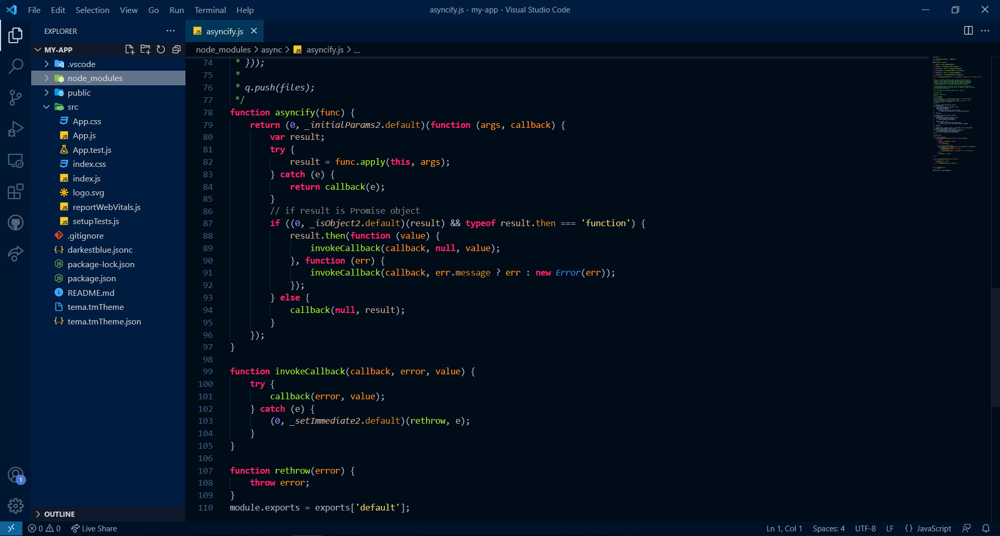

# GapStyle DeepBlue VSCode - Being Productive (But I'm blue...)

Just a simple recolor of background of the loved classic [GapStyle](https://github.com/gaplo917/GapStyle) to be rocked on VSCode 🤘.

Now in a deep blue background palette .

  

<small><i>\* The world-first color scheme uses affinitive color platte design to boost developers' productivity by using
similar colors to represent semantically similar syntax, i.e. class, abstract class, and interface in Kotlin, Java,
Scala, etc. See [GapStyle Specification](https://github.com/gaplo917/GapStyle/tree/master/spec#color-palette)
</i></small>

# Learn More About GapStyle

### How can GapStyle boost productivity?

- [GapStyle Specification](https://github.com/gaplo917/GapStyle/tree/master/spec/README.md#gapstyle-specification)
  - [Semantic Highlighting Optimized](https://github.com/gaplo917/GapStyle/tree/master/spec/README.md#semantic-highlighting-optimized)
  - [Recommended Font](https://github.com/gaplo917/GapStyle/tree/master/spec/README.md#recommended-font)
  - [Color Palette](https://github.com/gaplo917/GapStyle/tree/master/spec/README.md#color-palette)
  - [Special Styling](https://github.com/gaplo917/GapStyle/tree/master/spec/README.md#special-styling)
  - [Special File Type](https://github.com/gaplo917/GapStyle/tree/master/spec/README.md#special-file-type)
